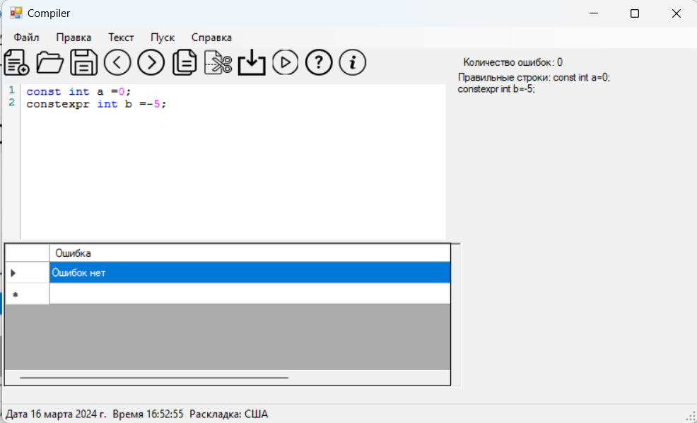
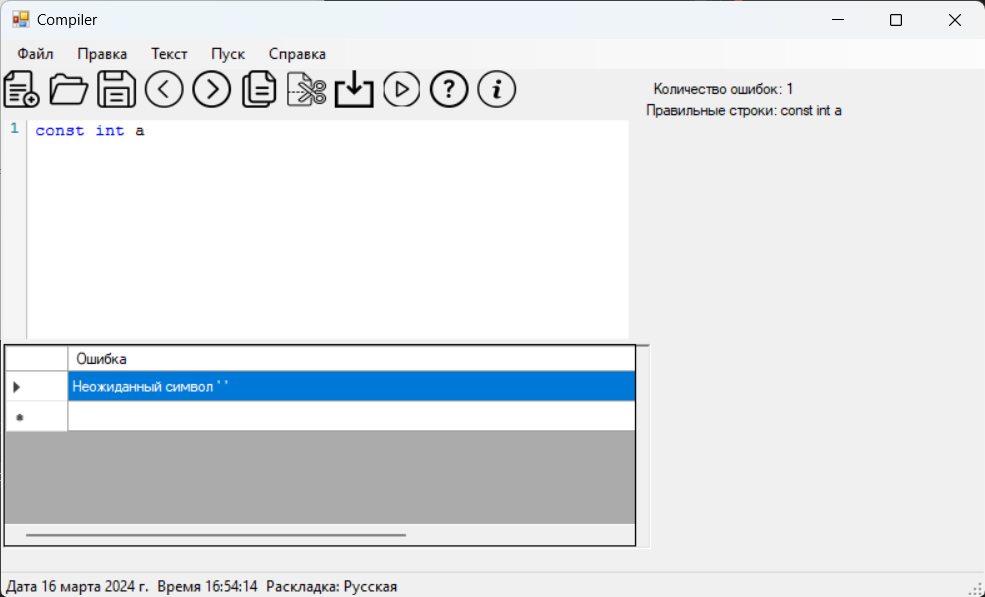
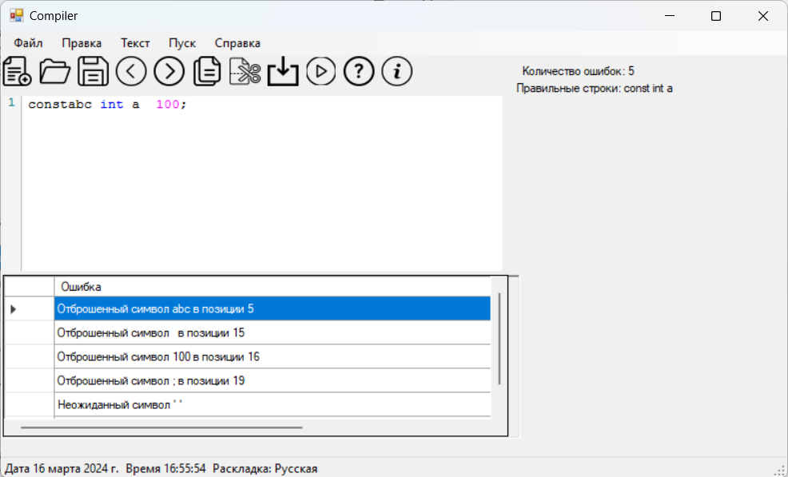

<html>
<head>   
    <h2>Вариант: Объявление целочисленной константы с инициализацией на языке C/С++</h2>
</head>
<body>
    
<b><i>Примеры допустимых строк:</b></i>

    
const int abc = 123; 

        
constexpr int b= 123; 

        
const int d = -123; 

        
<b><i>Разработанная грамматика:</b></i>
    
        
const int a = +-123;

1) DEF -> [‘const’|”constexpr”] CONST 

2) CONST -> ‘_’ INT

3) INT -> ‘int’ INTREM

4) INTREM -> ‘_’ ID

5) ID ->letter IDREM

6) IDREM -> letter IDREM

7) IDREM -> ‘=’EQUAL

8) EQUAL -> [+ | -] NUMBER

9) NUMBER -> digit NUMBERREM

10) NUMBERREM -> digit NUMBERREM

	11) NUMBERREM -> ;

    
    
</body>

<b><i>Классификация грамматики: </b></i>автоматная
        
        
<b><i>Граф конечного автомата: </b></i>
 
           
    
<b><i>Тестовые примеры:</b></i>

 
    
    
    
    
    
    

</html>